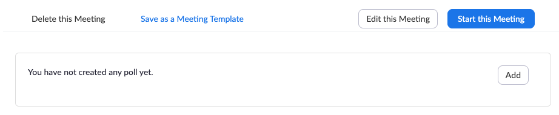

Zoom Polling Tools
==================

This repo contains a couple of tools that simplify running polls in Zoom meetings. The following points are addressed:

* Semi-automated creation of polls. I saw screenshots of Zoom users being able to configure polls via CSV file upload, but at least in my Zoom accounts, this functionality is missing.
* Summarization of poll results. While meetings are still running, poll results are shown on the meeting's settings page (https://zoom.us/meeting/id). Afterwards, the raw inputs of each user can be downloaded as a CSV file (Polling Report), but the summaries are not available anymore.

Creating a poll
---------------

After enabling Polling for your account in the [settings](https://zoom.us/profile/setting), open the page for your meeting on the Zoom website. Whether it's scheduled for the future or currently running, it should be listed in the [list of your upcoming meetings](https://zoom.us/meeting).

At the bottom of the page, there should be a polls section:



Prepare your poll as a JSON object in a text editor. A poll can have up to 10 questions, each with 2-10 answers. If you need more questions, split them into multiple poll objects.

```javascript
poll = [
    {
        "question": "What is your name?",
        "answers": [
            "Sir Lancelot of Camelot",
            "Peter"
        ]
    },
    {
        "question": "What is your quest?",
        "answers": [
            "To seek the Holy Grail",
            "To give an update on our project's progress to stakeholders"
        ]
    },
    {
        "question": "What is the air-speed velocity of an unladen swallow?",
        "answers": [
            "An African or European swallow?",
            "50 to 65 km/h"
        ]
    }
]
```

Add the following function and invocation to your editor:

```javascript
function createPoll(questions, poll_name) {
    $("#manage_polling_edit_button").click();
    $("#poll_name").val(poll_name);
    $("#anonymous").click();

    for (let i = 0; i < questions.length; i++) {
        const answers = questions[i].answers;
        if (i > 0) {
            $(".btn-question a").click();
        }

        let questionBox = document.querySelectorAll(".question-template")[i];
        $(questionBox.querySelector("textarea#question")).val(questions[i].question);

        for (let j = 0; j < answers.length; j++) {
            $(questionBox.querySelectorAll(".answer_list input")[j]).val(answers[j]);
        }
    }
}

createPoll(poll, "Bridge of Death certification");
```

On the meeting page, open the web inspector of your browser and switch to the Javascript console. Paste object declaration, function declaration and invocation in one go and hit return. Try to save the poll. There can be errors, e.g. if one of the answers exceeds the maximum length.


Creating a summary from a poll report
-------------------------------------

`summarize_reports.py` takes a poll report as the input and prints a summary. For each question, the question text, answer texts and the number of responses per answer are listed.

1. After your meeting has ended, open the [meeting reports list](https://zoom.us/account/my/report/regmeeting) on the Zoom site.
2. Select "Poll Report" and click search to switch to the right mode
3. Find your meeting and click "Generate"
4. Download your report from the report queue page once it's ready. If the file is empty, regenerate the report at a later time.
5. Run `summarize_reports.py` against the file:

```sh
$ ./summarize_reports.py ~/Downloads/poll_report.csv
What is your name?
Peter: 1
Sir Lancelot of Camelot: 2

What is your quest?
To give an update on our project's progress to stakeholders: 1
To seek the Holy Grail: 2

What is the air-speed velocity of an unladen swallow?
50 to 65 km/h: 2
An African or European swallow?: 1
```

An alternative to running this tool after the meeting is to open the meeting page (https://zoom.us/meeting/id) during the meeting. Once the polls have ended, the results can be saved, e.g. by printing the page to a PDF.